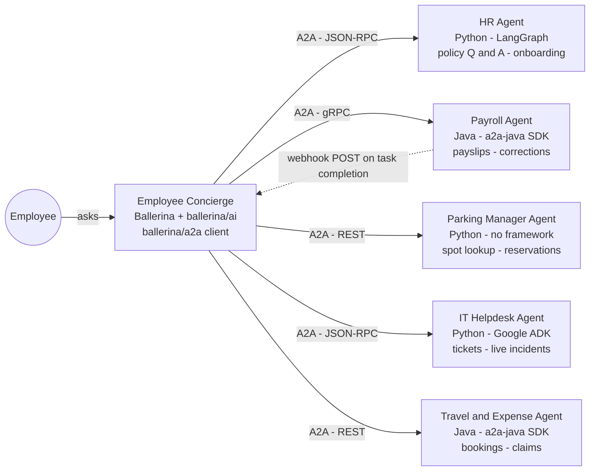

# Employee Concierge: one orchestrator, five agents, three transports, two languages

> Source: [Employee Concierge Architecture](https://claude.ai/code/artifact/4630c2c1-4859-48ad-950e-01888a74ce4d)
> (approved proposal artifact, `ballerina/a2a` end-to-end demo architecture)

A single client-side orchestrator, built on Ballerina and `ballerina/a2a`, fields
employee requests and routes them to five independent listener agents — each a
separately deployable A2A server, deliberately built in different languages and
frameworks, so the demo proves real interoperability rather than one framework
talking to itself.

## Architecture

The orchestrator is the only thing employees talk to. Every specialist behind it
is reached purely over the open A2A protocol — the orchestrator has no other
integration with any of them.

Five independently deployable agents sit behind the orchestrator, each a genuine
A2A server — different language, different framework, different transport
binding — reached purely through the open protocol. The one reversed edge is a
push-notification webhook the agent calls back into the orchestrator, not the
orchestrator polling it.

## The orchestrator

**Employee Concierge** is the single agent every employee actually talks to — a
chat-style front end backed by a Ballerina `ai:Agent`, reaching every specialist
behind it purely through `ballerina/a2a`.

Stack: **Ballerina**, **ballerina/ai** (or WSO2 Integrator: BI), **ballerina/a2a client**.

The LLM decides which specialist a given request belongs to; `ballerina/a2a` is
the only thing that actually talks to it. How each agent gets registered with
the orchestrator is still open and will be decided separately.

## The five listener agents

Every agent is a real, independently running A2A server — not a stub. Language,
framework, and transport binding are chosen so the five together prove every one
of the client's 11 operations and all three transport bindings, with genuine
multi-language interoperability.

### HR Agent
**Stack:** Python · LangGraph · JSON-RPC

Policy questions answered instantly; onboarding is a real multi-step, multi-day
checklist streamed live.

**Proves:** `sendMessage`, `sendStreamingMessage`, `subscribeToTask`, `getExtendedAgentCard`

### Payroll Agent
**Stack:** Java · a2a-java SDK · Quarkus · gRPC

A payslip-correction request is a genuine reviewed task, and its resolution is
the clearest case for a push notification of the whole demo.

**Proves:** `getTask`, `cancelTask`, `listTasks`, `createTaskPushNotificationConfig`,
`getTaskPushNotificationConfig`, `listTaskPushNotificationConfigs`,
`deleteTaskPushNotificationConfig`, `getExtendedAgentCard`

### Parking Manager Agent
**Stack:** Python · no framework · REST (HTTP+JSON)

Simple enough to need no agent framework at all — a spot lookup and a
reservation, proving A2A works fine without an LLM in the loop.

**Proves:** `sendMessage`, `cancelTask`, `createTaskPushNotificationConfig`,
`deleteTaskPushNotificationConfig`

### IT Helpdesk Agent
**Stack:** Python · Google ADK · JSON-RPC

FAQ answers alongside a real ticket lifecycle, plus a live incident
investigation you can disconnect from and resume.

**Proves:** `sendMessage`, `getTask`, `cancelTask`, `listTasks`,
`sendStreamingMessage`, `subscribeToTask`

### Travel & Expense Agent
**Stack:** Java · a2a-java SDK · REST (HTTP+JSON)

An expense claim moves through review over days — cancelable, listable, and
worth a notification when reimbursed.

**Proves:** `getTask`, `cancelTask`, `listTasks`, `createTaskPushNotificationConfig`,
`getTaskPushNotificationConfig`

## Full coverage, one system

Every one of the client's 11 operations and all three transport bindings is
exercised by at least one agent above — most by more than one, since a real
employee's day naturally touches several.

| Operation | Exercised by |
|---|---|
| `sendMessage` | HR · Parking · IT Helpdesk |
| `sendStreamingMessage` | HR (onboarding) · IT Helpdesk (incident) |
| `getTask` | Payroll · IT Helpdesk · Travel & Expense |
| `cancelTask` | Payroll · Parking · IT Helpdesk · Travel & Expense |
| `subscribeToTask` | HR · IT Helpdesk |
| `listTasks` | Payroll · IT Helpdesk · Travel & Expense |
| `createTaskPushNotificationConfig` | Payroll · Parking · Travel & Expense |
| `getTaskPushNotificationConfig` | Payroll · Travel & Expense |
| `listTaskPushNotificationConfigs` | Payroll |
| `deleteTaskPushNotificationConfig` | Payroll · Parking |
| `getExtendedAgentCard` | HR (staff-only escalation skill) · Payroll (admin-only cross-employee adjustment skill) |
